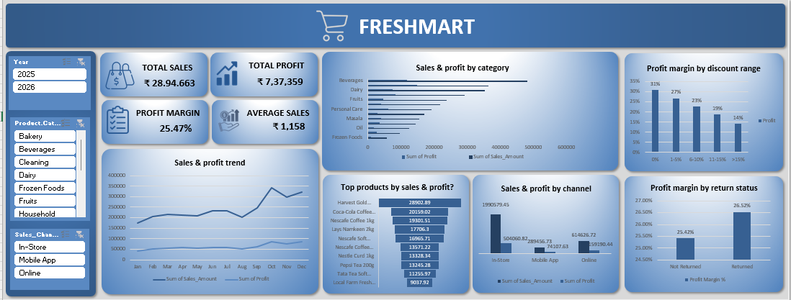

# FreshMart Sales Analysis Dashboard

## Business Problem

### Why did FreshMart sales fall sharply in January 2026 compared with December 2025?

FreshMart recorded **₹3.05 lakh in sales in December 2025**, but sales fell to only **₹0.92 lakh in January 2026** — a **69.7% month-on-month decline**.

The dashboard shows that this was not mainly caused by customers spending much less per order. The **average order value decreased from ₹1,160 to ₹1,075 (7.3%)**, while the number of orders dropped from **263 to 86 (67.3%)**. Quantity sold also fell from **1,066 to 333 (68.8%)**.

The data indicates that the main business problem was therefore a **sharp reduction in customer/order volume**, rather than a major collapse in basket value.

### What contributed to the decline?

- **In-Store sales** fell by approximately **₹1.45 lakh (67.8%)**, the largest absolute channel decline.
- **Online sales** fell by **75.6%**, while **Mobile App sales** fell by **71.0%**.
- **Beverages** declined by **78.0%**, **Bakery by 74.8%**, and **Rice by 81.5%**.
- **Weekend sales** fell by **74.2%**, a larger decline than weekday sales at **63.0%**.
- **West region sales** fell by **87.5%**, making it the most severely affected region.
- Profit also fell from **₹82,160 to ₹22,606**, a decline of **72.5%**.

These findings suggest that FreshMart experienced a broad-based reduction in transaction activity across channels, categories and regions.

### Solution

FreshMart should focus on **recovering order volume first**, while protecting profitable categories.

1. **Increase customer traffic and orders**
   - Run targeted promotions immediately after the December peak.
   - Use loyalty offers and repeat-purchase campaigns to bring existing customers back in January.
   - Create weekend-specific promotions because weekend sales experienced the largest decline.

2. **Recover digital sales**
   - Launch app-only and online-only discounts or bundle offers.
   - Send personalized offers to customers who purchased frequently in December but did not return in January.

3. **Prioritize high-impact categories**
   - Promote Beverages, Bakery, Dairy and Snacks because they experienced large absolute sales declines.
   - Check inventory availability for these categories before assuming the decline is demand-driven.

4. **Target the West region**
   - Investigate store-level sales in the West region because its sales dropped **87.5%**.
   - Check whether specific stores, stock availability or local promotions caused the regional decline.

5. **Use December as a benchmark**
   - Compare January store, product and customer performance against December every year.
   - Set January recovery targets based on order count as well as sales value.

**Business objective:** Restore transaction volume and improve sales without relying only on deeper discounts, while maintaining FreshMart's profitability.

## Dataset / Source Details

The project uses the provided **FreshMart sales transaction dataset** in
Excel format.

### Dataset structure

  -----------------------------------------------------------------------
  Sheet                               Purpose
  ----------------------------------- -----------------------------------
  `Sales_Transactions`                Cleaned transaction-level data used
                                      for analysis

  `Sales_Trans`                       Original/working transaction data

  `Sales_Trans_1`                     Extended transaction data used
                                      during the analysis

  `Store`                             Store information such as region,
                                      city, type, target and status

  `Employee`                          Employee details and store
                                      assignment

  `Customer`                          Customer demographic and membership
                                      information

  `Product`                           Product, category, brand, price and
                                      supplier information

  `Pivot_KPIs`                        Pivot-based KPI calculations and
                                      summaries

  `Data_Profiling`                    Data-quality issues identified and
                                      cleaning actions

  `Dashboard`                         Final interactive dashboard
  -----------------------------------------------------------------------

The cleaned `Sales_Transactions` sheet contains **2,500 sales
transactions** and **18 analytical columns**, including transaction
date, customer, product, store, employee, quantity, pricing, discount,
sales, cost, profit, payment mode, return status, sales channel, order
time and day type.

------------------------------------------------------------------------

## Tools / Excel Techniques Used

The project was developed using **Microsoft Excel** and the following
techniques:

-   Excel Tables
-   Power Query for data preparation
-   Data type correction and standardization
-   Duplicate identification
-   Blank/null value identification
-   Find & Replace for standardizing inconsistent values
-   Conditional Formatting for data-quality checks
-   PivotTables
-   PivotCharts
-   Slicers for interactive filtering
-   `GETPIVOTDATA` for KPI extraction
-   Aggregation of Sales, Profit and Orders
-   Dashboard layout and KPI cards
-   Trend, category, product and channel analysis

------------------------------------------------------------------------

## Data Cleaning / Analysis Explanation

Several data-quality issues were identified and addressed before
creating the dashboard.

### Cleaning performed

1.  **Duplicate invoice numbers**
    -   Duplicate invoice records were identified.
    -   The data-profiling sheet records approximately 20 duplicate
        invoice occurrences for review.
2.  **Transaction date formatting**
    -   Different date formats were standardized into a consistent date
        format.
    -   Data types were corrected using Excel/Power Query techniques.
3.  **Missing Customer IDs**
    -   8 blank Customer ID values were identified.
4.  **Missing Product IDs**
    -   6 blank Product ID values were identified.
5.  **Missing Store IDs**
    -   4 blank Store ID values were identified.
6.  **Missing Employee IDs**
    -   5 blank Employee ID values were identified.
7.  **Quantity validation**
    -   6 records were flagged during the profiling process for
        quantity-related checking.
8.  **Sales amount formatting**
    -   Currency symbols/text inconsistencies were removed so that Sales
        Amount could be treated as a numeric field.
9.  **Payment mode standardization**
    -   Inconsistent payment-mode values were standardized using Find &
        Replace.
10. **Order time**

-   Order Time was originally stored as text and was converted into a
    usable time/number format.

After cleaning and validation, the cleaned transaction table was used as
the basis for the dashboard analysis.

------------------------------------------------------------------------

## KPIs / Features Explained

The dashboard contains four major KPI cards:

### Total Sales

**₹28,94,662.90**

Represents the total sales amount generated from the analyzed
transactions.

### Total Profit

**₹7,37,358.89**

Represents the total profit generated after accounting for the recorded
cost amount.

### Total Orders

**2,500**

Represents the total number of transaction/invoice records analyzed.

### Average Sales

**₹1,157.87**

Represents the average sales value per transaction.

### Dashboard Filters

The dashboard also provides interactive slicers for:

-   Year
-   Sales Channel
-   Product

These filters allow users to analyze the dashboard from different
business perspectives.

------------------------------------------------------------------------

## Dashboard Features

The dashboard includes the following visualizations:

### Monthly Sales & Profit Trend

A line chart compares monthly sales and profit to identify changes in
performance over time.

### Sales & Profit by Category

A category-level comparison shows how different product categories
contribute to sales and profit.

### Top 10 Products

A ranked chart highlights the products generating the highest sales
amounts.

### Sales by Channel

A comparison of **In-Store, Mobile App and Online** sales channels shows
where customers generate the most revenue.

------------------------------------------------------------------------

## Key Insights

Based on the cleaned transaction data and dashboard analysis:

### 1. Strong overall sales performance

FreshMart generated approximately **₹28.95 lakh in sales** and **₹7.37
lakh in profit** across **2,500 transactions**.

### 2. In-Store is the dominant sales channel

In-Store sales contribute approximately **₹19.91 lakh**, making it the
largest sales channel.

Online contributes approximately **₹6.15 lakh**, while Mobile App
contributes approximately **₹2.89 lakh**.

This indicates that the physical-store experience remains the primary
revenue driver.

### 3. Beverages is the highest-sales category

**Beverages** generated approximately **₹4.75 lakh in sales**, making it
the strongest category by sales value.

Other strong categories include:

-   Bakery --- approximately ₹3.65 lakh
-   Dairy --- approximately ₹3.54 lakh
-   Snacks --- approximately ₹2.92 lakh

### 4. Bakery is a major profit contributor

Although Beverages has the highest sales, **Bakery generates the highest
profit** among the categories, at approximately **₹1.49 lakh**.

This indicates that sales volume alone does not determine profitability.

### 5. Product concentration

The top-selling products include products such as:

-   Harvest Gold Rusk 1kg
-   Coca-Cola Coffee 500g
-   Nescafe Coffee 1kg
-   Nestle Curd 1kg
-   Nescafe Soft Drinks Pack

These products should be closely monitored for stock availability and
repeat demand.

### 6. Monthly performance varies considerably

The monthly trend shows noticeable fluctuations in sales and profit. In
the available 2026 records, **March** is the strongest month by sales,
with approximately **₹1.53 lakh**, while sales decline considerably in
several later months.

This suggests that seasonal demand, promotions, product availability or
customer behavior may influence monthly performance.

------------------------------------------------------------------------

## Recommendations / Conclusion

### Recommendations

Based on the data-backed business problem above, FreshMart should:

- Focus on **increasing orders/customer traffic**, since order volume was the primary driver of the January decline.
- Use **weekend campaigns** to recover the 74.2% weekend sales drop.
- Strengthen **Online and Mobile App promotions** because both digital channels declined by more than 70%.
- Prioritize **Beverages, Bakery, Dairy and Rice** for inventory checks, bundles and targeted promotions.
- Investigate the **West region** at store level because it recorded the largest regional decline.
- Track **orders, quantity, average order value, sales and profit together** instead of relying on total sales alone.
- Use month-on-month comparisons to identify early warning signs before a large decline occurs.

### Conclusion

The FreshMart analysis shows that the major January 2026 problem was **not simply lower spending per customer**. The strongest signal was the **67.3% fall in order volume**, accompanied by large declines across all sales channels, major categories and regions.

The recommended strategy is therefore to rebuild customer traffic and transaction frequency, strengthen digital and weekend campaigns, protect availability of high-demand categories, and investigate severely affected regions such as West.

This approach directly addresses the business problem identified from the transaction data rather than treating data cleaning as the problem itself.

------------------------------------------------------------------------

## 10. Project Outcome

This project demonstrates practical skills in:

-   Excel data cleaning
-   Power Query
-   Data analysis
-   PivotTables and PivotCharts
-   KPI creation
-   Dashboard development
-   Business insight generation
-   Data-driven recommendations

The final output is an interactive FreshMart sales dashboard designed to
support quick and effective business decision-making.
