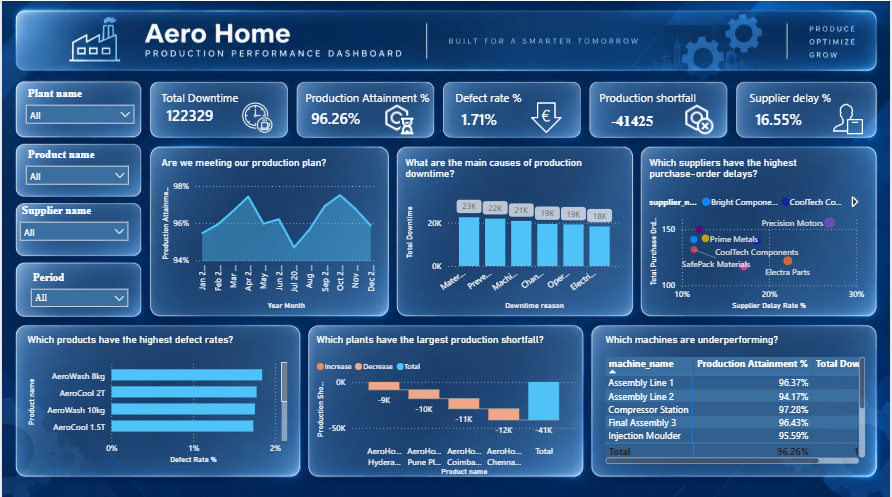

# Aero Home Production Performance Dashboard

## Business Problem

### How can AeroHome improve production plan attainment by identifying the plants, downtime causes, quality issues, and supplier delays contributing to the production shortfall?

AeroHome's Production Performance Dashboard was developed to understand the gap between planned and actual production and identify the operational factors that may be contributing to production shortfalls.

The dashboard focuses on a specific COO-level operational path rather than attempting to answer every analytical question in the manufacturing dataset.

The analysis concentrates on:

1. **Are we meeting our production plan?**
2. **What are the main causes of production downtime?**
3. **Which suppliers have the highest purchase-order delays?**
4. **Which plants have the largest production shortfall?**
5. **Which products have the highest defect rates?**
6. **Which machines are underperforming?**

### Business Objective

**Improve production plan attainment by identifying the plants, downtime causes, quality issues, supplier delays, and machine-level performance factors associated with production shortfalls.**

### Solution

The AeroHome dashboard connects production performance with the operational factors that management can investigate.

1. **Measure production plan attainment**
   - Compare actual production with planned production.
   - Track Production Attainment % as a key performance indicator.
   - Use the monthly trend to identify periods where production is below plan.

2. **Identify production shortfall at plant level**
   - Compare plant contributions to production shortfall.
   - Identify plants with larger negative production contributions.
   - Prioritize these plants for operational investigation.

3. **Identify downtime causes**
   - Rank downtime reasons by total downtime.
   - Use cumulative downtime to understand which causes account for the largest share of lost production time.
   - Identify the downtime areas that should be addressed first.

4. **Investigate quality performance**
   - Identify products with comparatively high defect rates.
   - Use product-level quality results to identify areas requiring further review.

5. **Review machine performance**
   - Compare Production Attainment % and Total Downtime by machine.
   - Identify machines that combine weaker production attainment with higher downtime.

6. **Review supplier delivery risk**
   - Identify suppliers with higher purchase-order delay rates.
   - Highlight suppliers that may require operational or procurement follow-up.

---

## Dataset / Source Details

The project uses the provided **AeroHome Manufacturing Dataset** and was modeled and analyzed in **Microsoft Power BI**.

### Dataset Structure

| Sheet / Table | Purpose |
|---|---|
| `dim_plants` | Plant master data, location and daily production capacity |
| `dim_products` | Product master data, product type, category, unit cost and target price |
| `dim_machines` | Machine master data, machine type, plant and installation year |
| `dim_operators` | Operator information, plant, shift, experience and hourly rate |
| `dim_suppliers` | Supplier master data, country and supplier rating |
| `dim_materials` | Raw-material master data and standard cost |
| `bridge_bill_of_materials` | Product-to-material relationship and required material quantity |
| `fact_production` | Production runs, planned units, produced units, defects, downtime and energy consumption |
| `fact_quality` | Quality inspections, inspected units, defective units, defect type and inspection status |
| `fact_downtime` | Downtime events, reasons, categories, machines and downtime minutes |
| `fact_purchase_orders` | Purchase orders, suppliers, materials, quantities, prices, lead times and delivery status |

The dataset contains **2,210 production records**, **2,200 quality inspection records**, **1,300 downtime records**, and **1,100 purchase-order records**, along with the supporting dimension and bridge tables.

---

## Dashboard

The AeroHome dashboard converts the selected business problem into a focused operational-performance story.



### How the dashboard addresses the business problem

| Business Question | Dashboard Solution | Business Use |
|---|---|---|
| **Are we meeting our production plan?** | Production Attainment % trend | Shows whether actual production is keeping pace with the production plan |
| **What are the main causes of production downtime?** | Downtime Pareto-style chart | Identifies the downtime reasons accounting for the most lost time |
| **Which suppliers have the highest purchase-order delays?** | Supplier delay-rate scatter plot | Highlights suppliers with higher delay rates and their purchase-order volume |
| **Which plants have the largest production shortfall?** | Plant production-shortfall waterfall chart | Identifies plants contributing most to the overall shortfall |
| **Which products have the highest defect rates?** | Product defect-rate ranking | Identifies products requiring quality investigation |
| **Which machines are underperforming?** | Machine performance matrix | Compares production attainment and downtime to identify machines requiring attention |

---

## KPIs / Features Explained

### Total Downtime

**122,329**

Represents the total downtime shown in the dashboard's current report context.

### Production Attainment %

**96.26%**

Measures actual production against planned production.

**Production Attainment % = Actual Production ÷ Planned Production**

A value below 100% indicates that actual production is below the planned production level.

### Defect Rate %

**1.71%**

Represents the defect rate shown in the dashboard and provides an overall indication of production quality performance.

### Production Shortfall

**-41,425**

Represents the production gap between actual and planned production shown in the dashboard.

A negative value indicates that actual production is below planned production.

### Supplier Delay %

**16.55%**

Represents the supplier delay rate shown in the dashboard.

---

## Dashboard Features

### 1. Production Plan Attainment

A **line chart** tracks Production Attainment % across Year Month.

**Business purpose:**  
Shows when production is falling below plan and allows management to identify periods requiring attention.

### 2. Downtime Cause Analysis

A **combined column and line / Pareto-style chart** compares Total Downtime by downtime reason and displays Cumulative Downtime %.

**Business purpose:**  
Identifies the downtime causes responsible for the largest share of lost production time.

### 3. Supplier Delay Analysis

A **scatter chart** compares Supplier Delay Rate % with Total Purchase Orders.

**Business purpose:**  
Allows management to identify suppliers with higher delay rates while considering the volume of purchase orders they handle.

### 4. Plant Production Shortfall

A **waterfall chart** shows how individual plants contribute to the overall Production Shortfall.

**Business purpose:**  
Helps management identify which plants are driving the production gap.

### 5. Product Defect Rate

A **horizontal bar chart** ranks products by Defect Rate %.

**Business purpose:**  
Highlights products with comparatively high defect rates for quality investigation.

### 6. Machine Performance

A **matrix** compares Machine Name, Production Attainment %, and Total Downtime.

**Business purpose:**  
Helps identify machines that may require attention because of weaker production attainment and/or higher downtime.

---

## Tools / Power BI Techniques Used

The project was developed using **Microsoft Power BI** and includes:

- Power Query data cleaning and transformation
- Data profiling and preparation
- Data modeling
- Fact and dimension tables
- Date table
- Relationships between tables
- DAX measures
- KPI cards
- Line charts
- Combined column and line chart
- Scatter chart
- Horizontal bar chart
- Waterfall chart
- Matrix visual
- Interactive slicers
- Year and Year Month filtering
- Month sorting using a Year Month Sort field
- Visual-level filtering
- Interactive cross-filtering
- Dashboard formatting and theme customization
- Business-question-driven visualization
- Executive dashboard storytelling

---

## Key Measures

### Actual Production

```DAX
Actual Production =
SUM(fact_production[quantity_produced])
```

### Planned Production

```DAX
Planned Production =
SUM(fact_production[planned_units])
```

### Production Attainment %

```DAX
Production Attainment % =
DIVIDE(
    [Actual Production],
    [Planned Production],
    0
)
```

The Production Attainment % measure compares actual production with planned production and is used as the main production-performance indicator.

Additional measures in the dashboard support:

- Total Downtime
- Production Shortfall
- Defect Rate %
- Supplier Delay Rate %
- Cumulative Downtime %

---

## Dashboard Filters

The dashboard provides interactive slicers for:

- **Plant name**
- **Product name**
- **Supplier name**
- **Period**

The **Period** slicer is organized using Year and Year Month so users can select a year and then view the months associated with that year.

These slicers allow management to move from the overall AeroHome view to specific plants, products, suppliers and time periods.

---

## Key Insights

The dashboard is designed to support the following operational conclusions:

### 1. Production is below the planned level

The dashboard shows a **96.26% Production Attainment**, indicating that actual production is below the planned production level in the displayed context.

### 2. There is a measurable production shortfall

The dashboard reports a **Production Shortfall of -41,425**, establishing the production gap as the central operational issue.

### 3. The shortfall is concentrated across specific plants

The plant waterfall identifies the plants contributing negatively to the production shortfall. This allows management to focus investigation on the largest contributors instead of treating the shortfall as a uniform company-wide problem.

### 4. Downtime is an important operational factor to investigate

The downtime analysis ranks the major downtime reasons and shows their cumulative contribution. This helps management prioritize the causes that account for the greatest amount of lost production time.

### 5. Quality issues can be traced to specific products

The product defect-rate ranking highlights products with comparatively higher defect rates. These products can be investigated for process, material or production-quality issues.

### 6. Machine-level performance provides another layer of diagnosis

The machine matrix combines Production Attainment % with Total Downtime, helping identify machines that may be contributing to weaker operational performance.

### 7. Supplier delays represent a supporting supply-chain risk

The supplier analysis highlights suppliers with higher purchase-order delay rates and allows management to consider delay exposure alongside purchase-order volume.

---

## Recommendations / Conclusion

### Recommendations

Based on the selected business problem and dashboard analysis, AeroHome should:

- Investigate the plants with the largest negative contribution to Production Shortfall.
- Review the major downtime reasons identified by the Pareto analysis and prioritize the causes accounting for the largest share of lost time.
- Investigate products with the highest defect rates for possible quality and process issues.
- Review machines with lower Production Attainment % and higher Total Downtime.
- Follow up with suppliers showing higher purchase-order delay rates.
- Use the plant, product, supplier and period slicers to perform targeted investigation instead of relying only on overall KPIs.
- Continue monitoring Production Attainment % over time so that deviations from plan can be identified early.

### Conclusion

The AeroHome dashboard provides a focused **COO-level operational performance view** centered on improving production plan attainment.

The analytical story follows:

**Production Plan → Production Shortfall → Plant Contribution → Downtime Causes → Quality Issues → Machine Performance → Supplier Delays**

Rather than attempting to cover every analytical area in the manufacturing dataset on one dashboard page, this report focuses on the selected production-performance problem and the operational factors most relevant to investigating the shortfall.

The dashboard therefore supports management in moving from **identifying the production gap** to **understanding where the gap is occurring and which operational areas require further investigation**.

---

## Project Outcome

This project demonstrates practical skills in:

- Power BI data cleaning and transformation
- Data modeling
- DAX measure development
- KPI creation
- Production performance analysis
- Production plan attainment analysis
- Production shortfall analysis
- Plant-level analysis
- Product quality analysis
- Downtime root-cause analysis
- Machine performance analysis
- Supplier performance analysis
- Interactive slicers
- Executive dashboard design
- Business-question-driven visualization
- Operational insight generation
- Data-driven recommendations

The final output is an interactive **AeroHome Production Performance Dashboard** designed to help management improve production plan attainment by identifying the plants, downtime causes, quality issues, machine performance factors and supplier delays associated with operational shortfalls.
