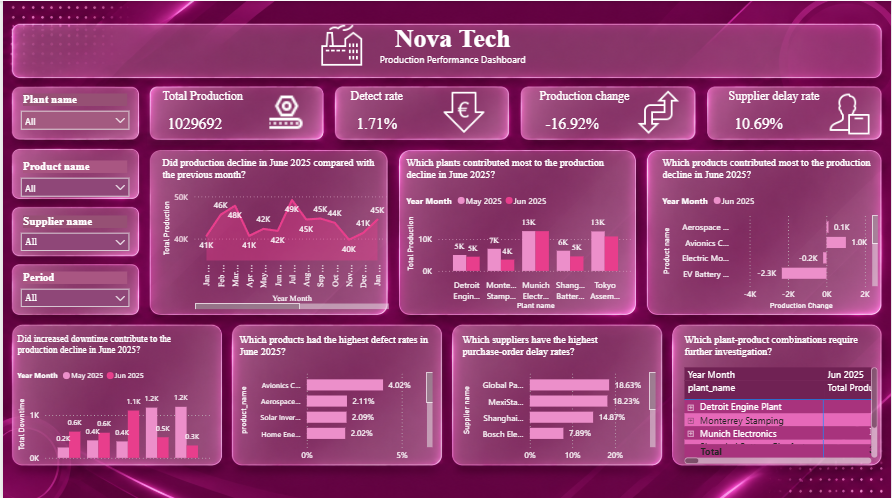

# Nova Tech Production Performance Dashboard

## Business Problem

### Why did production volume decrease in June 2025 compared to May 2025, and which plants and products were responsible for the decline?

Nova Tech's production performance dashboard was developed to investigate the reported **June 2025 production decline compared with May 2025** and identify the operational areas contributing to that change.

The dashboard focuses on answering three management-level questions:

1. **Did production decline in June 2025 compared with the previous month?**
2. **Which plants contributed most to the production decline?**
3. **Which products contributed most to the production decline?**

To support the root-cause investigation, the dashboard also examines **downtime, product defect rates, supplier purchase-order delays, and plant-product combinations requiring further investigation**.

### Business Objective

**Identify the main operational contributors to the June 2025 production decline so that management can prioritize corrective action across plants, products, downtime causes, quality issues, and supplier performance.**

### Solution

The Power BI dashboard provides an interactive view of production performance and its contributing factors.

1. **Measure the production change**
   - Compare monthly production performance and identify the June 2025 movement.
   - Track total production and production change through KPI cards.
   - Use the monthly production trend to provide context for the June 2025 comparison.

2. **Identify plant-level contributors**
   - Compare May 2025 and June 2025 production across plants.
   - Identify plants showing the largest negative movement.
   - Use the plant comparison to prioritize operational investigation.

3. **Identify product-level contributors**
   - Compare product production changes between the relevant periods.
   - Identify products with the largest negative contribution to the decline.
   - Use product-level results to support targeted operational review.

4. **Investigate operational causes**
   - Compare downtime in May and June 2025.
   - Examine whether increased downtime contributed to the production decline.
   - Review downtime-related patterns for further investigation.

5. **Review supporting operational risks**
   - Identify products with higher defect rates.
   - Identify suppliers with higher purchase-order delay rates.
   - Highlight plant-product combinations that require further investigation.

---

## Dataset / Source Details

The project uses the provided **Nova Tech manufacturing dataset**, modeled in Microsoft Power BI.

### Data Model Structure

The Power BI model contains the following major tables:

| Table | Purpose |
|---|---|
| `fact_production` | Production quantities, planned units and production-related operational data |
| `fact_downtime` | Downtime records, downtime minutes and downtime reasons |
| `fact_purchase_orders` | Purchase-order and supplier delivery information |
| `fact_quality` | Quality and defect-related information |
| `dim_plants` | Plant master data |
| `dim_products` | Product master data |
| `dim_suppliers` | Supplier master data |
| `dim_machines` | Machine master data |
| `dim_materials` | Material master data |
| `DateTable` | Date, month, year and Year Month analysis |
| `bridge_bill_of_materials` | Analytical/modeling table used by the report measures |

The analysis uses monthly production information, with **June 2025** as the main comparison period against **May 2025**.

---

## Dashboard

The Nova Tech dashboard converts the business problem into a focused operational investigation.



### How the dashboard addresses the business problem

| Business Question | Dashboard Solution | Business Use |
|---|---|---|
| **Did production decline in June 2025 compared with the previous month?** | Monthly production trend + Production Change KPI | Confirms the direction and scale of the production movement |
| **Which plants contributed most to the production decline?** | May 2025 vs June 2025 plant production comparison | Identifies plants requiring operational attention |
| **Which products contributed most to the production decline?** | Product-level production change comparison | Identifies products responsible for negative production movement |
| **Did increased downtime contribute to the production decline?** | May 2025 vs June 2025 downtime comparison | Tests downtime as a potential operational cause |
| **Which products have the highest defect rates?** | Product defect-rate ranking | Highlights quality areas that may require investigation |
| **Which suppliers have the highest purchase-order delay rates?** | Supplier delay-rate ranking | Identifies supplier delivery risks that may affect operations |
| **Which plant-product combinations require further investigation?** | Plant-product detail table | Supports deeper investigation of specific operational combinations |

---

## KPIs

### Total Production

**1,029,692**

Represents the total production shown in the dashboard for the current report context.

### Defect Rate

**1.71%**

Represents the defect rate shown in the dashboard.

### Production Change

**-16.92%**

Represents the production change shown in the dashboard and supports the investigation into the production decline.

### Supplier Delay Rate

**10.69%**

Represents the supplier purchase-order delay rate shown in the dashboard.

---

## Dashboard Features

### 1. Monthly Production Trend

A **line chart** compares production across Year Month.

**Business purpose:**  
Provides the overall production trend and helps identify changes around the June 2025 comparison period.

### 2. Plant Production Comparison

A **clustered column chart** compares plant production for May 2025 and June 2025.

**Business purpose:**  
Shows which plants experienced the largest changes and helps identify the plants contributing to the overall production movement.

### 3. Product Production Change

A **diverging bar chart** shows product-level production change.

**Business purpose:**  
Separates positive and negative product contributions and makes the products associated with the decline easier to identify.

### 4. Downtime Comparison

A **clustered column chart** compares downtime between May 2025 and June 2025 by plant.

**Business purpose:**  
Helps determine whether increased downtime coincided with the production decline.

### 5. Product Defect Rate

A **horizontal bar chart** ranks products by defect rate.

**Business purpose:**  
Highlights products with comparatively high defect rates for quality investigation.

### 6. Supplier Purchase-Order Delay Rate

A **horizontal bar chart** ranks suppliers by purchase-order delay rate.

**Business purpose:**  
Identifies suppliers with higher delivery-delay exposure.

### 7. Plant-Product Investigation Table

A **matrix/table** provides plant-product level production details.

**Business purpose:**  
Allows management to move from high-level findings to specific plant-product combinations requiring further investigation.

---

## Tools / Power BI Techniques Used

The project was developed using **Microsoft Power BI** and includes:

- Power Query data cleaning and transformation
- Data profiling and preparation
- Data modeling
- Fact and dimension tables
- Date table
- Relationships between tables
- DAX measures
- KPI cards
- Line charts
- Clustered column charts
- Diverging bar chart
- Horizontal bar charts
- Matrix/table visual
- Interactive slicers
- Year and Year Month filtering
- Month sorting using a Year Month Sort field
- Visual-level and page-level filtering
- Dashboard formatting and theme customization
- Interactive cross-filtering
- Business-focused dashboard storytelling

---

## Key Measures

The dashboard uses measures to calculate the main operational indicators.

### Total Production

```DAX
Total Production =
SUM(fact_production[quantity_produced])
```

### Production Change %

The dashboard uses a production-change calculation to compare the selected production period with the comparison period.

### Defect Rate

The dashboard uses a defect-rate measure to evaluate product quality performance.

### Supplier Delay Rate

The dashboard uses a supplier-delay measure to evaluate purchase-order delivery performance.

### Total Downtime

The dashboard uses total downtime to quantify production time lost through downtime events.

> The exact DAX definitions for the additional measures depend on the final Power BI model and should be kept consistent with the measures stored in the `.pbix` file.

---

## Dashboard Filters

The dashboard provides interactive slicers for:

- **Plant name**
- **Product name**
- **Supplier name**
- **Period**

The **Period** slicer is organized using Year and Year Month so that users can select a year and then examine the months belonging to that year.

These filters allow management to move from the overall production view to specific plants, products, suppliers, and periods.

---

## Key Insights

The dashboard is designed to support the following conclusions:

### 1. Production decline is the primary business issue

The dashboard reports a **-16.92% Production Change** KPI, making the change in production the central issue being investigated.

### 2. The decline can be traced to specific plants

The May 2025 versus June 2025 plant comparison allows management to identify the plants with the largest negative production movement rather than treating the decline as a company-wide issue only.

### 3. Product-level contribution provides the next level of diagnosis

The product production-change visual separates positive and negative movements, helping identify products that contributed to the decline and products that offset it.

### 4. Downtime provides an operational explanation

The May versus June downtime comparison helps determine whether increased production downtime coincided with the decline and which areas require further operational investigation.

### 5. Quality and supplier performance provide supporting risk indicators

The defect-rate and supplier-delay visuals extend the investigation beyond production volume and highlight quality and supply-chain issues that may require management attention.

### 6. Plant-product analysis supports targeted investigation

The plant-product matrix provides a detailed view for moving from an overall production issue to specific combinations that may require corrective action.

---

## Recommendations / Conclusion

### Recommendations

Based on the dashboard's selected business problem, Nova Tech should:

- Investigate the plants showing the largest negative production movement between May and June 2025.
- Investigate the products contributing the largest negative production change.
- Review downtime increases alongside production losses to identify operational bottlenecks.
- Review products with higher defect rates for potential quality-related production impact.
- Follow up with suppliers showing higher purchase-order delay rates.
- Use the plant-product matrix to prioritize specific combinations for deeper investigation.
- Continue monitoring production change monthly so that emerging declines can be identified early.

### Conclusion

The Nova Tech dashboard provides a focused COO-level view of the **June 2025 production decline**. Rather than attempting to cover every possible manufacturing question in a single page, the dashboard follows a specific investigation path:

**Production decline → Plant contribution → Product contribution → Downtime → Quality → Supplier delays → Detailed investigation**

This approach keeps the dashboard focused on the selected business problem while providing enough supporting information for management to identify where corrective action should begin.

---

## Project Outcome

This project demonstrates practical skills in:

- Power BI data cleaning and transformation
- Data modeling
- DAX measure development
- KPI creation
- Production performance analysis
- Month-over-month comparison
- Plant-level analysis
- Product-level analysis
- Downtime analysis
- Quality analysis
- Supplier performance analysis
- Interactive slicers
- Dashboard design
- Business-question-driven visualization
- Operational insight generation
- Data-driven recommendations

The final output is an interactive **Nova Tech Production Performance Dashboard** designed to help management understand the June 2025 production decline and identify the plants, products, and supporting operational factors requiring attention.
